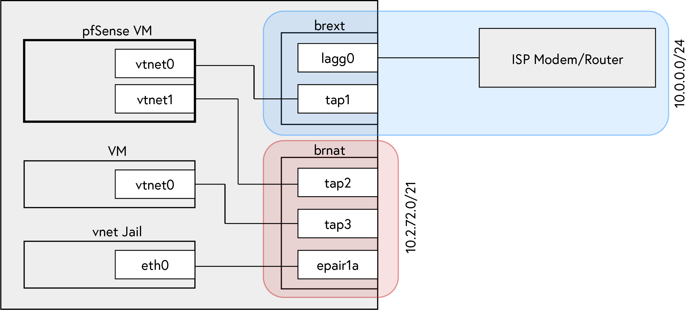

Previously I used my Rogers modem with a few ports forwarded to services on my network (SSH bastion host, HTTPS reverse proxy, _etc._) for Internet-facing access. This changed when [Rogers](https://www.rogers.com/customer/support/article/use-port-forwarding-ignite-wifi-hub) removed conventional port forwarding functionality from their Ignite line of modems. Instead you [need to use the myRogers portal](http://web.archive.org/web/20210312235253/https://www.rogers.com/customer/support/article/use-port-forwarding-ignite-wifi-hub) to configure your device over the Internet, and you cannot aim the forwarded port at an IP address, rather it enumerates what it thinks all your devices' friendly names are, showing one "device" per MAC adddress. The device _does_, however, allow you to place an IP address in the device's DMZ &mdash; effectively exposing all ports on that device to the Internet.

### Provisioning Virtual Network Infrastructure

Previously, I used [`iocage(8)`](https://www.freebsd.org/cgi/man.cgi?query=iocage&sektion=8&n=1) to provision shared IP jails to host the services mentioned above, but as you can see from [`ifconfig(8)`](https://www.freebsd.org/cgi/man.cgi?query=ifconfig&sektion=8&n=1) output below aliasing multiple IP addresses to a single hardware device does not give each software device its own MAC address and hence Rogers Ignite could not port forward to any of my jails.

```
re0: flags=8943<UP,BROADCAST,RUNNING,PROMISC,SIMPLEX,MULTICAST> metric 0 mtu 1500
	options=8209b<RXCSUM,TXCSUM,VLAN_MTU,VLAN_HWTAGGING,VLAN_HWCSUM,WOL_MAGIC,LINKSTATE>
	ether 68:1c:a2:12:38:79
	inet 10.0.0.105 netmask 0xffffff00 broadcast 10.0.0.255
	inet 10.0.0.205 netmask 0xffffff00 broadcast 10.0.0.255
	inet 10.0.0.204 netmask 0xffffff00 broadcast 10.0.0.255
	inet 10.0.0.203 netmask 0xffffff00 broadcast 10.0.0.255
	media: Ethernet autoselect (1000baseT <full-duplex>)
	status: active
	nd6 options=29<PERFORMNUD,IFDISABLED,AUTO_LINKLOCAL>
```

Instead I decided to place a virtual machine in the modem's DMZ and port forward from this virtual device. I've wanted to use [`bhyve(8)`](https://www.freebsd.org/cgi/man.cgi?query=bhyve&sektion=8&n=1) for a while, and the most effective and fun way of learning technology is finding some practical application, so that is what I did.



To set this up I referenced the first two sections of _[Bhyve Networking Options](http://empt1e.blogspot.com/2016/10/bhyve-networking-options.html)_.

First, create a bridge `brext` and add `re0` to it:

```sh
% ifconfig bridge create name brext
brext
% ifconfig brext addm re0
% ifconfig brext
brext: flags=8802<BROADCAST,SIMPLEX,MULTICAST> metric 0 mtu 1500
	ether 02:cd:dd:24:07:00
	id 00:00:00:00:00:00 priority 32768 hellotime 2 fwddelay 15
	maxage 20 holdcnt 6 proto stp-rstp maxaddr 2000 timeout 1200
	root id 00:00:00:00:00:00 priority 0 ifcost 0 port 0
	member: re0 flags=143<LEARNING,DISCOVER,AUTOEDGE,AUTOPTP>
	        ifmaxaddr 0 port 2 priority 128 path cost 20000
	groups: bridge
	nd6 options=1<PERFORMNUD>
% ifconfig brext up
% ifconfig re0 up
% dhclient brext
```

Now `brext` has an IP address from the ISP router's DHCP server:

```sh
% ifconfig brext
brext: flags=8843<UP,BROADCAST,RUNNING,SIMPLEX,MULTICAST> metric 0 mtu 1500
	ether 02:cd:dd:24:07:00
	inet 10.0.0.63 netmask 0xffffff00 broadcast 10.0.0.255
	id 00:00:00:00:00:00 priority 32768 hellotime 2 fwddelay 15
	maxage 20 holdcnt 6 proto stp-rstp maxaddr 2000 timeout 1200
	root id 00:00:00:00:00:00 priority 32768 ifcost 0 port 0
	member: re0 flags=143<LEARNING,DISCOVER,AUTOEDGE,AUTOPTP>
	        ifmaxaddr 0 port 2 priority 128 path cost 20000
	groups: bridge
	nd6 options=1<PERFORMNUD>
```

Later, we will connect the WAN interface of the pfSense VM to this bridge. Before we can set that up we'll need a bridge (I'll call mine `brnat`) to connect pfSense's LAN to though. 

```sh
% ifconfig bridge create name brnat up
brnat
% ifconfig brnat
brnat: flags=8843<UP,BROADCAST,RUNNING,SIMPLEX,MULTICAST> metric 0 mtu 1500
	ether 02:cd:dd:24:07:01
	id 00:00:00:00:00:00 priority 32768 hellotime 2 fwddelay 15
	maxage 20 holdcnt 6 proto stp-rstp maxaddr 2000 timeout 1200
	root id 00:00:00:00:00:00 priority 32768 ifcost 0 port 0
	groups: bridge
	nd6 options=1<PERFORMNUD>
```

At this point, `brext` contains the `re0` device and `brnat` contains no devices. We'll create tap devices using [`cbsd(8)`](https://www.freebsd.org/cgi/man.cgi?query=cbsd&sektion=8&n=1) in the next step.

### Creating a pfSense VM

Before we can use [`cbsd(8)`](https://www.freebsd.org/cgi/man.cgi?query=cbsd&sektion=8&n=1) it needs to be initialized and the necessary kernel modules need to be loaded. This configuration may differ from system to system; I've linked [my CBSD initenv.conf answer file here](./cbsd-initenv.conf).

If `vmm.ko` isn't loaded [`cbsd(8)`](https://www.freebsd.org/cgi/man.cgi?query=cbsd&sektion=8&n=1) will give you the following error:

```
No kldloaded module: vmm
Please add vmm_load="YES" to /boot/loader.conf and
put kld_list="vmm if_tuntap if_bridge nmdm" into your /etc/rc.conf then reboot the host.
Press any key...
```

Follow the instructions in the error, combining `kld_list` options if your [`rc(8)`](https://www.freebsd.org/cgi/man.cgi?query=cbsd&sektion=8&n=1) configuration already as some set.

```sh
% kldload vmm
% sysrc -f /boot/loader.conf vmm_load="YES"
vmm_load:  -> YES
% sysrc kld_list="vmm if_tuntap if_bridge nmdm"
```