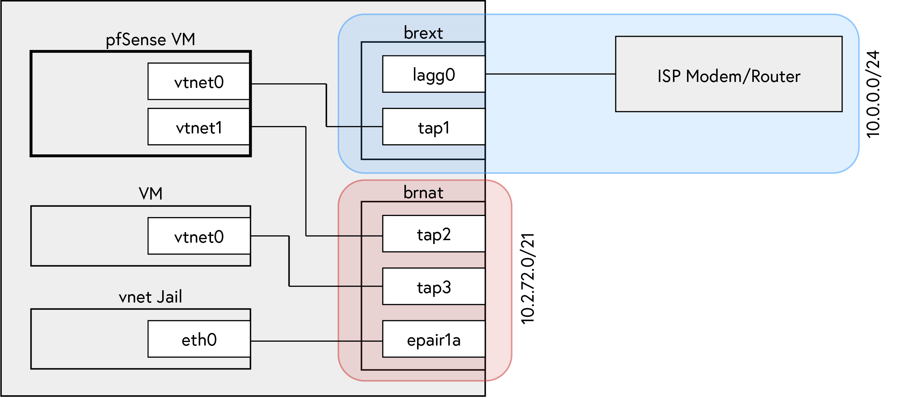
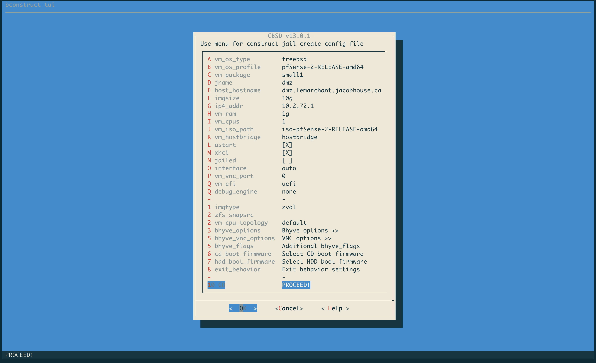
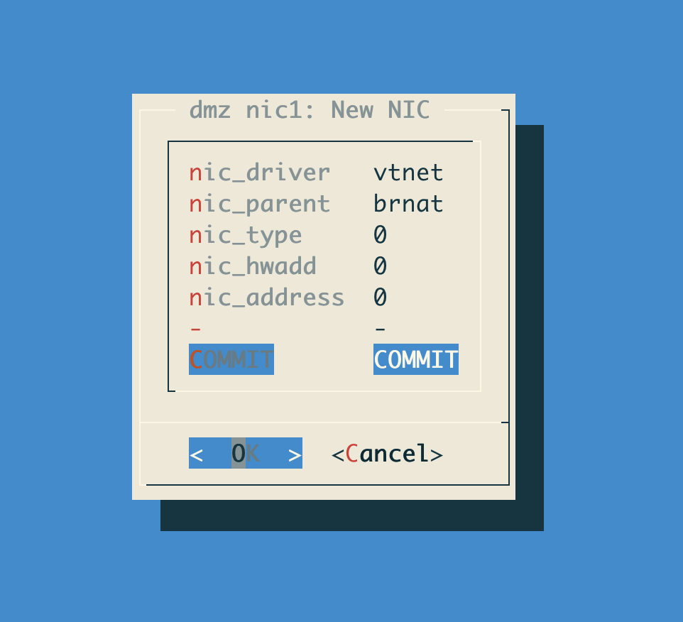
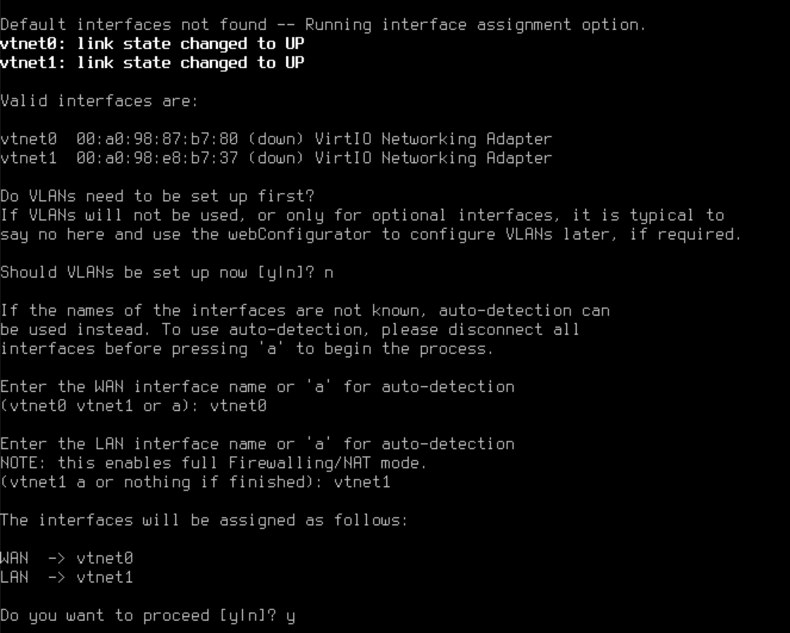

Previously I used my Rogers modem with a few ports forwarded to services on my network (SSH bastion host, HTTPS reverse proxy, _etc._) for Internet-facing access. This changed when [Rogers](https://www.rogers.com/customer/support/article/use-port-forwarding-ignite-wifi-hub) removed conventional port forwarding functionality from their Ignite line of modems. Instead you [need to use the myRogers portal](http://web.archive.org/web/20210312235253/https://www.rogers.com/customer/support/article/use-port-forwarding-ignite-wifi-hub) to configure your device over the Internet, and you cannot aim the forwarded port at an IP address, rather it enumerates what it thinks all your devices' friendly names are, showing one "device" per MAC adddress. The device _does_, however, allow you to place an IP address in the device's DMZ &mdash; effectively exposing all ports on that device to the Internet.

### Provisioning Virtual Network Infrastructure

Previously, I used [`iocage(8)`](https://www.freebsd.org/cgi/man.cgi?query=iocage&sektion=8&n=1) to provision shared IP jails to host the services mentioned above, but as you can see from [`ifconfig(8)`](https://www.freebsd.org/cgi/man.cgi?query=ifconfig&sektion=8&n=1) output below aliasing multiple IP addresses to a single device does not give each software device its own MAC address and hence Rogers Ignite could not port forward to any of my jails.

```
lagg0: flags=28943<UP,BROADCAST,RUNNING,PROMISC,SIMPLEX,MULTICAST,PPROMISC> metric 0 mtu 1500
	options=812098<VLAN_MTU,VLAN_HWTAGGING,VLAN_HWCSUM,WOL_MAGIC,VLAN_HWFILTER>
	ether 94:de:80:6b:27:6c
	inet 10.0.0.105 netmask 0xffffff00 broadcast 10.0.0.255
	inet 10.0.0.205 netmask 0xffffff00 broadcast 10.0.0.255
	inet 10.0.0.204 netmask 0xffffff00 broadcast 10.0.0.255
	inet 10.0.0.203 netmask 0xffffff00 broadcast 10.0.0.255
	laggproto loadbalance lagghash l2,l3,l4
	laggport: em0 flags=4<ACTIVE>
	laggport: igb0 flags=4<ACTIVE>
	groups: lagg
	media: Ethernet autoselect
	status: active
	nd6 options=29<PERFORMNUD,IFDISABLED,AUTO_LINKLOCAL>
```

Instead I decided to place a virtual machine in the modem's DMZ and port forward from this virtual device. I've wanted to use [`bhyve(8)`](https://www.freebsd.org/cgi/man.cgi?query=bhyve&sektion=8&n=1) for a while, and the most effective and fun way of learning technology is finding some practical application, so that is what I did.



To set this up I referenced the first two sections of _[Bhyve Networking Options](http://empt1e.blogspot.com/2016/10/bhyve-networking-options.html)_.

First, create a bridge `brext` and add `lagg0` to it:

```shell
% ifconfig bridge create name brext
brext
% ifconfig brext addm lagg0
% ifconfig brext up
% ifconfig lagg0 up
% dhclient brext
```

Now `brext` has an IP address from the ISP router's DHCP server.

```shell
% ifconfig brext
brext: flags=28943<UP,BROADCAST,RUNNING,PROMISC,SIMPLEX,MULTICAST,PPROMISC> metric 0 mtu 1500
	ether 02:cd:dd:24:07:00
	inet 10.0.0.63 netmask 0xffffff00 broadcast 10.0.0.255
	id 00:00:00:00:00:00 priority 32768 hellotime 2 fwddelay 15
	maxage 20 holdcnt 6 proto stp-rstp maxaddr 2000 timeout 1200
	root id 00:00:00:00:00:00 priority 32768 ifcost 0 port 0
	member: lagg0 flags=143<LEARNING,DISCOVER,AUTOEDGE,AUTOPTP>
	        ifmaxaddr 0 port 6 priority 128 path cost 10000
	groups: bridge
	nd6 options=9<PERFORMNUD,IFDISABLED>
```

Later, we will connect the WAN interface of the pfSense VM to this bridge. Before we can set that up we'll need a bridge (I'll call mine `brnat`) to which pfSense's LAN connects. In the same manner as `lagg0` was added to `brext` I will add `re0` to `brnat`. This will allow for other non-virtualized devices to connect to the NATted subnet via the hardware device `re0`.

```shell
% ifconfig bridge create name brnat up
brnat
% ifconfig brnat addm re0
% ifconfig brnat up
% ifconfig re0 up
% ifconfig brnat
brnat: flags=8802<BROADCAST,SIMPLEX,MULTICAST> metric 0 mtu 1500
	ether 02:cd:dd:24:07:01
	id 00:00:00:00:00:00 priority 32768 hellotime 2 fwddelay 15
	maxage 20 holdcnt 6 proto stp-rstp maxaddr 2000 timeout 1200
	root id 00:00:00:00:00:00 priority 0 ifcost 0 port 0
	member: re0 flags=143<LEARNING,DISCOVER,AUTOEDGE,AUTOPTP>
	        ifmaxaddr 0 port 2 priority 128 path cost 20000
	groups: bridge
	nd6 options=9<PERFORMNUD,IFDISABLED>
```

At this point, `brext` contains the `lagg0` device and `brnat` contains the `re0` device. We'll create tap devices using [`cbsd(8)`](https://www.freebsd.org/cgi/man.cgi?query=cbsd&sektion=8&n=1) in the next section. Before we do that, we should configure the new bridges' names and members in our [`rc(8)`](https://www.freebsd.org/cgi/man.cgi?query=cbsd&sektion=8&n=1) configuration. This will allow the configuration above to persist across host reboots. To do this I add the following to `/etc/rc.conf.local`:

```shell
bridge_enable="YES"
cloned_interfaces="lagg0 bridge0 bridge1"
ifconfig_lagg0="laggproto loadbalance laggport em0 laggport igb0 10.0.0.3/24"
ifconfig_bridge0_name="brext"
ifconfig_bridge1_name="brnat"
ifconfig_em0="up"
ifconfig_igb0="up"
ifconfig_re0="up"
autobridge_interfaces="brnat brext"
autobridge_brnat="re0"
autobridge_brext="lagg0"
```

### Creating a pfSense VM

Before we can use [`cbsd(8)`](https://www.freebsd.org/cgi/man.cgi?query=cbsd&sektion=8&n=1) it needs to be initialized and the necessary kernel modules need to be loaded. This configuration may differ from system to system; I've linked [my CBSD initenv.conf answer file here](./cbsd-initenv.conf).

If `vmm.ko` isn't loaded [`cbsd(8)`](https://www.freebsd.org/cgi/man.cgi?query=cbsd&sektion=8&n=1) will give you the following error:

```
No kldloaded module: vmm
Please add vmm_load="YES" to /boot/loader.conf and
put kld_list="vmm if_tuntap if_bridge nmdm" into your /etc/rc.conf then reboot the host.
Press any key...
```

Follow the instructions in the error, combining `kld_list` options if your [`rc(8)`](https://www.freebsd.org/cgi/man.cgi?query=cbsd&sektion=8&n=1) configuration already as some set.

After rebooting, we can now use the `cbsd bconstruct[-tui]` command to create the pfSense VM.



I named the VM `dmz`, chose the pre-canned pfSense configuration, and let DHCP choose an IP address for me. Proceed to the next stage in the constructor wizard and choose create VM now. We need to provide further network configuration so open the VM's settings by running `cbsd bconfig jname=dmz`. Open the `bhyvenic` menu and edit `nic1` (`vtnet`). Expand `nic_parent` and choose the `brext` bridge we created in the previous section. Return to the _Configure Virtual NIC_ menu and add another virtual NIC. This time set the parent NIC to be `brnat`.



Commit your changes and exit the `bconfig` wizard. Start the virtual machine. Since the VHD is empty, `cbsd(8)` will ask if you want to connect a virtual CD device and can download the source installation media from the Internet on its own. After the installer image is downloaded the VM will boot. You can connect to the VM's display using a VNC client. `cbsd(8)` prints the port that the VNC service is listening on when the VM starts, and it can also be viewed by running `cbsd bls`. If connecting to the [`bhyve(8)`](https://www.freebsd.org/cgi/man.cgi?query=bhyve&sektion=8&n=1) host over SSH, a SSH tunnel[^1] may also be used to connect to the VNC port remotely.

Notice now that running `ifconfig` on the [`bhyve(8)`](https://www.freebsd.org/cgi/man.cgi?query=bhyve&sektion=8&n=1) host yields output similar to below. Two tap interfaces have been created by [`bhyve(8)`](https://www.freebsd.org/cgi/man.cgi?query=bhyve&sektion=8&n=1) and each is a member of one of the bridges.

```
brext: flags=8843<UP,BROADCAST,RUNNING,SIMPLEX,MULTICAST> metric 0 mtu 1500
	ether 02:cd:dd:24:07:00
	inet 10.0.0.63 netmask 0xffffff00 broadcast 10.0.0.255
	id 00:00:00:00:00:00 priority 32768 hellotime 2 fwddelay 15
	maxage 20 holdcnt 6 proto stp-rstp maxaddr 2000 timeout 1200
	root id 00:00:00:00:00:00 priority 32768 ifcost 0 port 0
	member: tap1 flags=143<LEARNING,DISCOVER,AUTOEDGE,AUTOPTP>
	        ifmaxaddr 0 port 8 priority 128 path cost 2000000
	member: re0 flags=143<LEARNING,DISCOVER,AUTOEDGE,AUTOPTP>
	        ifmaxaddr 0 port 2 priority 128 path cost 20000
	groups: bridge
	nd6 options=1<PERFORMNUD>
brnat: flags=8843<UP,BROADCAST,RUNNING,SIMPLEX,MULTICAST> metric 0 mtu 1500
	ether 02:cd:dd:24:07:01
	id 00:00:00:00:00:00 priority 32768 hellotime 2 fwddelay 15
	maxage 20 holdcnt 6 proto stp-rstp maxaddr 2000 timeout 1200
	root id 00:00:00:00:00:00 priority 32768 ifcost 0 port 0
	member: tap2 flags=143<LEARNING,DISCOVER,AUTOEDGE,AUTOPTP>
	        ifmaxaddr 0 port 9 priority 128 path cost 2000000
	groups: bridge
	nd6 options=1<PERFORMNUD>
tap1: flags=8943<UP,BROADCAST,RUNNING,PROMISC,SIMPLEX,MULTICAST> metric 0 mtu 1500
	description: dmz-nic0
	options=80000<LINKSTATE>
	ether 58:9c:fc:10:ff:f4
	groups: tap vm-port
	media: Ethernet autoselect
	status: active
	nd6 options=29<PERFORMNUD,IFDISABLED,AUTO_LINKLOCAL>
	Opened by PID 85169
tap2: flags=8943<UP,BROADCAST,RUNNING,PROMISC,SIMPLEX,MULTICAST> metric 0 mtu 1500
	description: dmz-nic1
	options=80000<LINKSTATE>
	ether 58:9c:fc:10:2c:2c
	inet6 fe80::5a9c:fcff:fe10:2c2c%tap2 prefixlen 64 scopeid 0x9
	groups: tap vm-port
	media: Ethernet autoselect
	status: active
	nd6 options=21<PERFORMNUD,AUTO_LINKLOCAL>
	Opened by PID 85169
#
# Output is truncated to show only relevant sections.
#
```

Connect to the VM's display and follow the pfSense setup. Assign the WAN and LAN interfaces to the appropriate vNIC as shown below.




```
/etc/defaults/devfs.rules
```

```devfsrules
[devfsrules_jail=4]
add include $devfsrules_hide_all
add include $devfsrules_unhide_basic
add include $devfsrules_unhide_login
add path fuse unhide
add path zfs unhide
add path 'bpf*' unhide

[devfsrules_jail_vnet=5]
add include $devfsrules_jail
add path pf unhide
```


```
bstart init_systap warning: errmsg="Error:get_my_device_bridge_for_em0: ifconfig: SIOCIFCREATE2: File exists"
```

[^1]: The command syntax to create such a tunnel is `ssh -N -L [bind_address:]port:host:hostport destination`. For more information see [`ssh(1)`](https://www.freebsd.org/cgi/man.cgi?query=ssh&sektion=1).